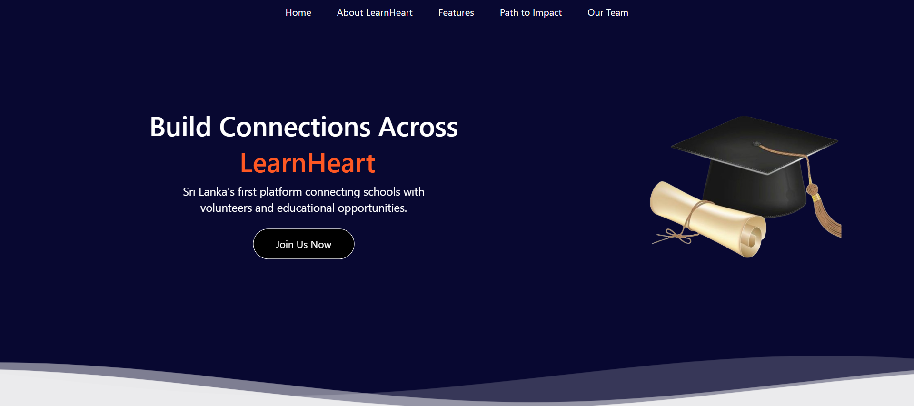

# LearnHeart Marketing Website

LearnHeart is an innovative platform aimed at bridging the educational gap in rural Sri Lankan schools. The project connects rural schools with volunteers and organizations, fostering collaboration for seminar requests. It aligns with the United Nations Sustainable Development Goal 4, promoting quality education for all.

## Features

- **User-Friendly Interface**: A simple, intuitive website to help users navigate seminar requests and interactions.
- **Responsive Design**: Optimized for desktop and mobile devices to ensure accessibility.
- **Sustainable Development Focus**: Contributes to the achievement of SDG 4 by helping rural students gain access to educational resources.

